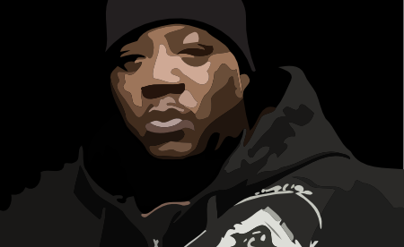

# Danze
An example of how to add Rails-like 'Magic' to your [Calabash](http://calaba.sh/) test suite.

##Documentation
A brief amount of documentation can be found [here](http://danze.mattriley.wtf).

##Contribute
Feel free to contribute and make this more useful than it is.

Please be aware of the [Code of conduct](code_of_conduct.md)